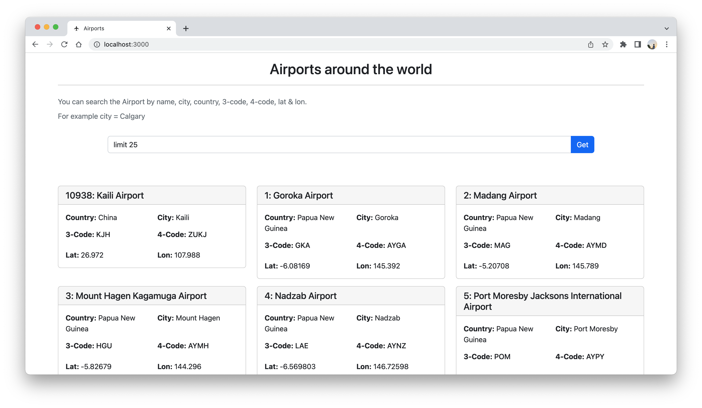
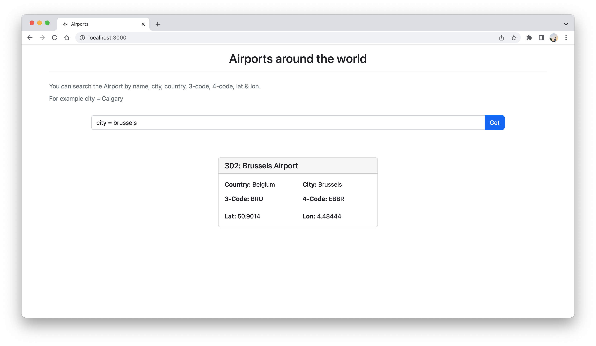
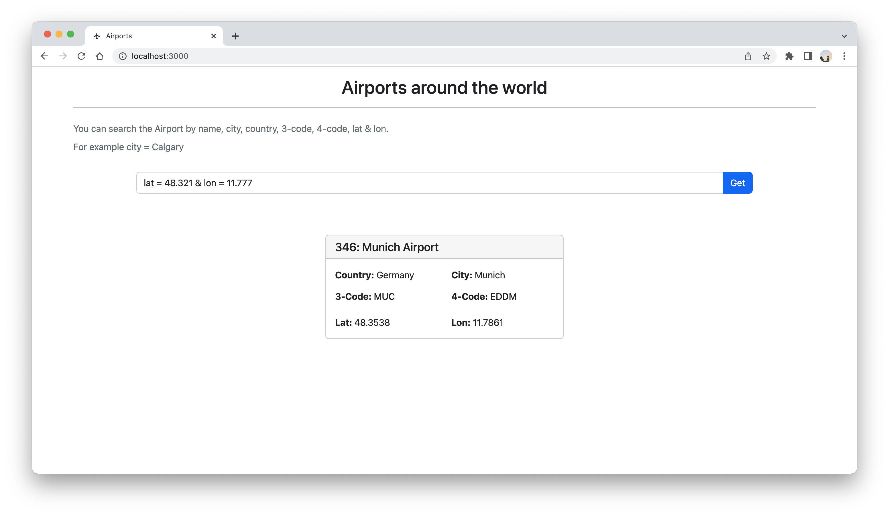
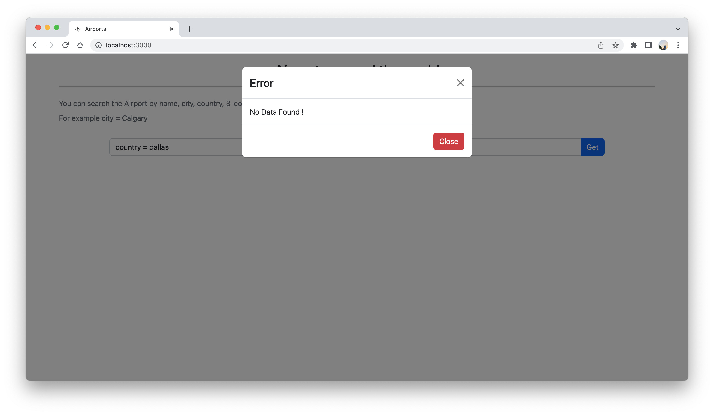

# Project setup

- This project contains Frontend & Backend.
- The backend is written in Node.js with supporting packages like Express.js and pg.
- The frontend is written in React.js with supporting packages like react-bootstrap.

## Installation

- For backend, type
  `npm install` in the terminal of this directory.
- For Frontend, go to the frontend folder and type `npm install` in the terminal.

## Starting up a project

- Both frontend & backend will start via `npm start` command in their respective folder directory.
- The frontend will start on [http://localhost:3000/](http://localhost:3000/)
- The backend will start on [http://localhost:8000/](http://localhost:8000/)

## API

### FindAll

Just specify LIMIT in the search bar:

`LIMIT number (OPTIONAL: OFFSET number)`

### FindOne

You can search the Airport by name, city, country, 3-code, 4-code,
Just type in the search bar:

`column_name = value`

### FindClosest (by lat & lon)

Just type lat & lon values in the search bar:

`lat = value & lon = value`

## Providing invalid input will result an Error

