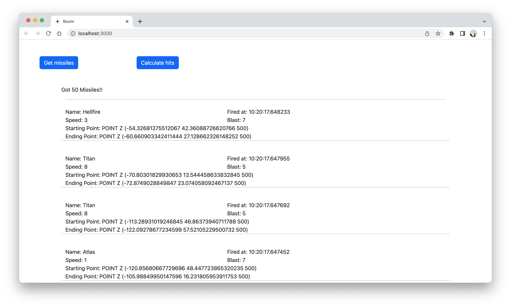

# Description

## missiles_info

- it contains 3 columns name, blast, speed.
- All of that are predefined into the database.
- We will join this table with newly generated missiles.

## missiles_position

- It contains randomly generated missiles from server.
- It shows the starting and ending points of the line.
- Scripts of generating points and inserting data contains variables and functions because, those things are being handled by the server.

## Screenshot of the frontend, which shows the generated missiles.

