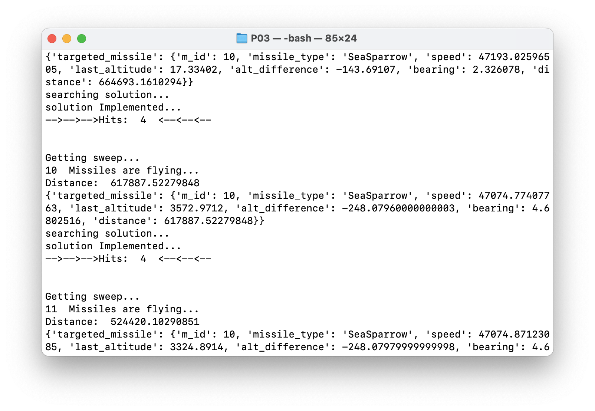
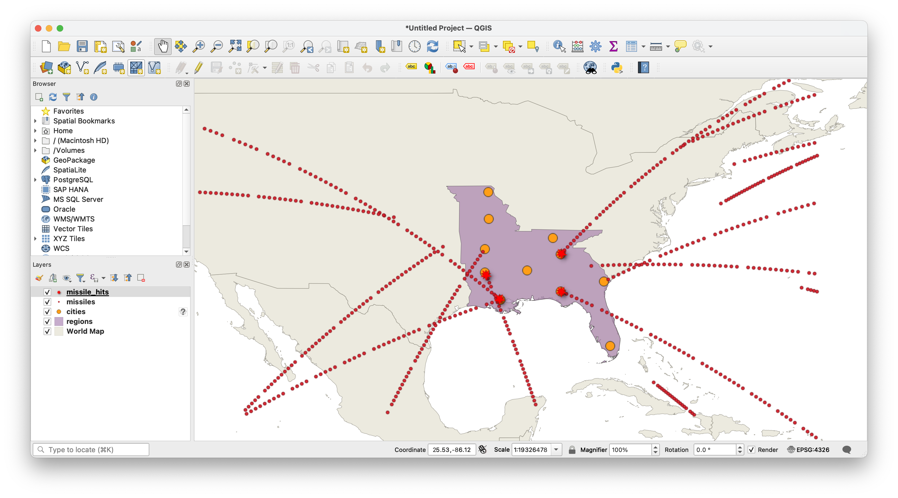

# Missile Command

- test_api contains all the APIs.
- function.py works as a helper, where all the functions are defined.

## APIs

### /REGISTER:

- initial api

### /START:

- inform server to start firing missiles with providing team_id.

### /calculate_area:

- returns Area in sqm and center point location.

### /show_bounding_box:

- Returns the points of bounding box polygon

### /create_batteries:

- returns the 5 battery points

### /determine_hits:

- creates a table in postgres with the prediction of landing geometry, expected time and boolean if it is hitting to the region or not.

### /Radar_sweep:

- Gets the latest information of the missiles from the server.

- After receiving the data it process all the data and determine hits, and possible solution.
  
  

- It fires back the missile but the accuracy is questionable.

### /create_shp_file:

- Generates the shape file of the provided table name.

### /Reset_game:

- As name suggest, it resets the game.
