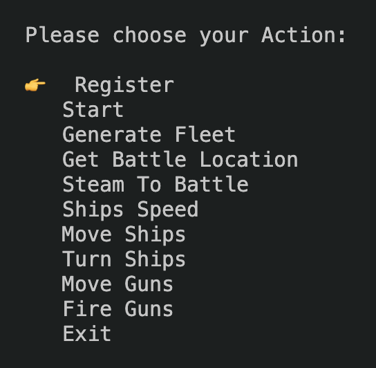
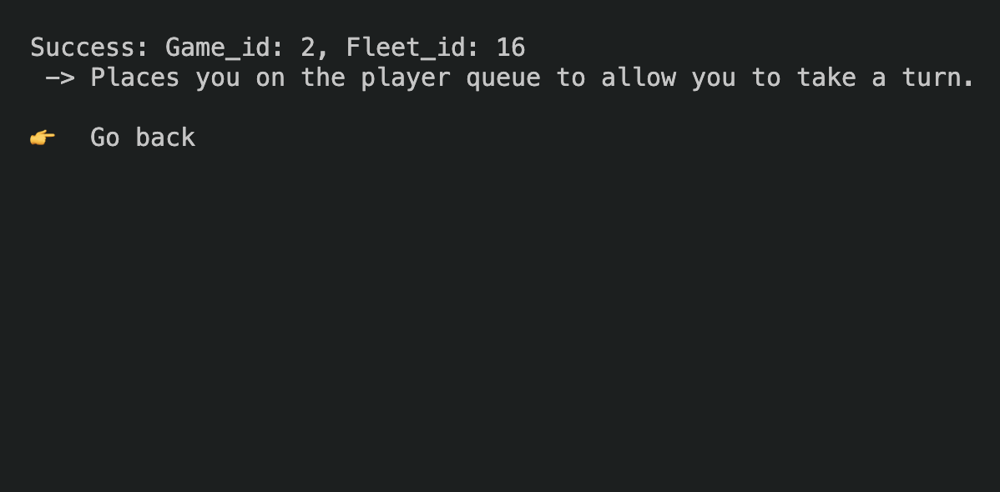

# Description

## api.py

- latest version of the api.

## function.py

- It has supporting functions of api.

## Menu.py

- It works as a console menu to perform various actions.
- Library used: [Pick](https://github.com/wong2/pick)
- It dose not cover all the functionality.
- 
- 

## Communication

- It mostly works as provided, have not changed much.
